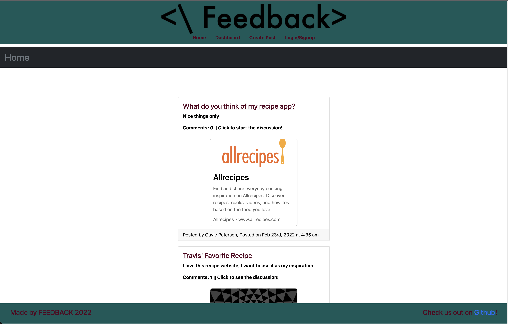

# FEEDback

  
  
  ## Table of Contents
  -[Project Description](#projectDescription)
  -[Table of Contents](#tableofContents)
  -[Usage](#usage)
  -[License](#license)
  -[Contributing](#contributing)
  -[Questions](#questions)

  ## Project Description 
  This is a group project made for the University of Utah Coding Bootcamp. We made it because we thought a site like this would help others also learning about coding. 

  Check it out here!  
  https://polar-mountain-81832.herokuapp.com/

  

  
  
  ## Languages Used 
  Javascript,CSS,HTML
  Built with REACT

 

  ### What will the app be used for? 
  This application can be used by anyone that wants feedback/help on sites or applications they are building.

  ### How can you contribute?
  Fork your own copy of the repo, and have fun!

  ### Credits and Contributors 
  Jill Holmes, Brett Howard, Travis Lloyd, Calvin Yan

  ### License
  This application is covered under the Open license
  

  ### Questions
  -------------------------------------------------------------------------------------------------------
  
  Any questions? Check us out on Github!: (https://github.com/Jillium) (https://github.com/Brett-NT) 
  (https://github.com/Infinitelooping) (https://github.com/pc611652003)
  
  
  